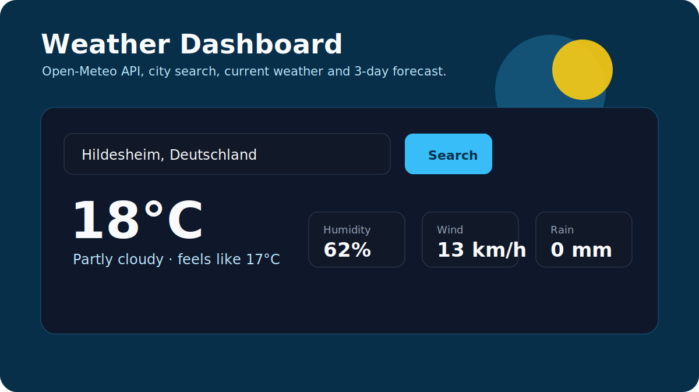

# Furkan Korhan Portfolio



Personal portfolio site for [furkankorhan.com](https://furkankorhan.com).

This project is not only a visual landing page. It is a small proof of how I work: I can plan a simple interface, build it with modern web tools, deploy it, connect a custom domain, and document the decisions behind it.

## What This Shows

- A responsive one-page portfolio built with Next.js and TypeScript
- A custom animated intro using a frame sequence
- Clean sections for profile, focus areas, projects, and contact
- Live mini demos for application tracking and weather API data
- Deployment on Vercel with a custom domain
- Practical attention to design, layout, performance, and maintainability

## Tech Stack

- Next.js
- React
- TypeScript
- Tailwind CSS
- Framer Motion
- Vercel

## Project Structure

```txt
src/app/              App Router pages, metadata, sitemap, OG image
src/components/       Portfolio sections and UI components
src/hooks/            Small interaction hooks
src/lib/              Animation frame metadata
public/sequence/      WebP frame sequence for the hero animation
public/robots.txt     Search engine crawling rules
```

## Main Sections

- `ScrollyCanvas`: animated visual intro
- `Kurzprofil`: short personal profile
- `Fokus`: current technical focus areas
- `Projects`: selected project directions
- `/application-tracker`: small browser tool for application workflow tracking
- `/weather-dashboard`: Open-Meteo API demo with city search and forecast data
- `WarumInformatik`: why I work toward Informatik
- `Contact`: portfolio, GitHub, and email links

## Design Decisions

- The first screen should create a strong visual signal without becoming a marketing page.
- The language is German because the site supports applications in Germany.
- The project list is intentionally small. Each listed topic should become a real GitHub proof, not just a buzzword.
- The site avoids claiming expert status. It shows direction, taste, and practical execution.

## Local Development

```bash
npm install
npm run dev
```

Open [http://localhost:3000](http://localhost:3000).

## Quality Checks

```bash
npm run lint
npm run build
```

## Current Status

Live and usable. Next improvements:

- Add a downloadable Lebenslauf link when the public CV version is finalized
- Keep the project cards aligned with real work instead of listing too many unfinished ideas
